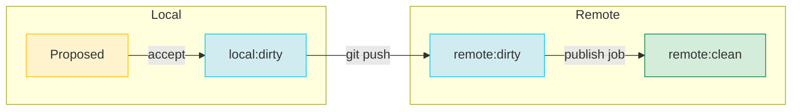

# Scratch Desktop milestone: Overview

## Purpose

The Vision doc covers *why* we're building Scratch. This doc is the product overview for the **Scratch Desktop milestone** — what we're building, what we're shipping, and what the product looks like. A designer can sketch wireframes and an engineer can architect the local data model from this doc. 

## Milestone

### Product description

A desktop app to review bulk changes from AI, with a new review screen focused on bulk editing approvals

### Scenarios

**HubSpot CRM enrichment (primary scenario).** Your sales team scraped LinkedIn profiles and you need to merge them into HubSpot — matching contacts, filling in missing fields, flagging duplicates. An agent does the matching and merging, you review every change in Scratch Desktop before publishing to HubSpot. (See Vision doc for full walkthrough.)

**Shopify SEO overhaul (demo-only for now).** Bulk-rewrite 400 product titles and descriptions for SEO using an agent, review diffs, publish. This is the most visually compelling demo but can't ship to real users until we have Shopify connector approvals. We can film it as a demo.

### Goal

Ship 3 demo videos showing the core loop end-to-end and send a blast to existing Whalesync users. This is our public debut of Scratch Desktop — not a capital-L Launch, but a real product people can try.

### Key tech components

- New desktop app, focused as exclusively on review as possible. It can bundle the CLI for managing git state.
- Diff / review screen — big piece of new UI
- Adjust the branch model to handle local files and accepting changes
- Some work to existing web UI to play nicely with desktop

## Design

### Branch Model

Currently diffs are all between two server branches: dirty and clean. We need to support local branches for local iteration, and to model the difference between proposed changes and accepted changes.

- Suggested changes are the local filesystem's uncommitted changes
- Accepted changes get committed to the local **dirty** branch
- The client's diff viewer is showing uncommitted local changes
- At publish time, the local dirty branch is pushed to the **remote** dirty branch, and a normal publish happens

### Key Concepts

These are the nouns of the product. Mostly the same as current Scratch except as noted.

| Concept | Changes | Client / Server | Description |
|---------|---------|-----------------|-------------|
| Workspace | — | Both | Top-level container. Owns a git repo. User switches between workspaces. |
| Local Workspace | ⚠️ Updated | Client | A folder on disk where the workspace's dirty branch is cloned |
| ConnectorAccount | — | Server | Stored credentials + config for an external service connection. |
| Git filestore | ⚠️ Branch model changed | Both | Still a git repo with record files. No changes to the filestore itself. Branch usage changes slightly, see **Branch Model** section above. |
| Record File | — | Both | A JSON file representing one record. Still JSON format. |
| Jobs | — | Server | Async background tasks (pull, publish, sync). |
| Schedule | 🚫 N/A | Server | Automated scheduling for Pull, Publish, or Sync actions. Out of scope for Desktop. |
| Sync / SyncMapping | 🚫 N/A | Server | Config for syncing between folders. Keeps existing, not working on it. No client-side support. |

### Desktop App
*Wireframes are WIP and should clarify this. Diff views will sound pretty similar to what we had this fall, picture that or Joel's demos until we work through details*

#### Main Screen: Data & Diff View

The main screen is a **data table that is also the diff viewer.** There's no separate "review mode" — the data view and the diff view are the same screen with different visual treatment and filters applied.

**Default state (no changes):** Grid showing all records and columns from the workspace's data folders. This is what you see after a fresh pull, along with a call-to-action to go dirty some files.

**With changes (agent has edited files):** Same grid, but proposed records and columns are visually highlighted. Defaults to showing modified records and columns only, with a toggle to show everything.

**Folder summary view:**
- Grid view of the records in the folder
- Visual indicators: modified, added, deleted
- Filter controls: all records / modified only / added only / deleted only
- Changes can be **accepted in bulk** — by row, by column, or select-all
- Future work for smarter bulk accept/reject actions
- Also buttons to 'discard accepted changes'

**Record detail view:**
- Column-style detail view showing all fields for one record
- Before/after for each changed field
- Can accept or reject changes per-field
- Toggle to whole-record raw JSON view
- For long-form text fields: inline diff with accept/reject within the text (not just field-level)
- Free text editing still available — user can manually tweak before accepting

**Diff bases:**
- We have three versions of each text: proposed, accepted, published.
- Proposed vs accepted is the main diff we care about. This is where you're reviewing and accumulating changes, and your actions are accept vs discard.
- Accepted vs published is also visualized, but less loudly. We will need to provide visualizations and actions on both (TBD)

**What's out this milestone:**
- Offline mode. You need a network connection for anything to work for now.
- [controversial] Manually editing the cells in the record detail page

#### Toolbar

A toolbar gives quick access to everything that connects the user to their data outside the app:

- **Open in Finder** — opens the local workspace folder
- **Open in Terminal** — opens a terminal at the workspace path (the CLI is bundled, so this is immediately useful)
- **Copy workspace path** — for pasting into other tools
- **Pull latest** — pulls records from all services, then pulls and rebases on clean branch from remote (current behavior + local pull)
- **Publish** — pushes accepted changes (see Publish Flow below)
- **Connections & tables** — shows list; create/edit connections and linked tables opens web app
- Future: "Open in Claude" / "Open in Codex" shortcuts if those tools support directory-based working

#### Agent Integration (this milestone)

For this milestone, we don't give the agent much help: **the agent works with the files on disk, and the desktop app watches for changes.**

The local workspace at `~/Documents/Scratch/{workspace name}/` contains record files as JSON. Any agent that can read and write files (Claude Code, Cursor, a Python script, etc.) can edit them. The desktop app detects the changes and shows them as diffs.

How to get started with an agent: open the workspace in a terminal or point Claude at the directory. That's it.

**What's out this milestone:**
- "Advertising to agents" (MCP server, tool descriptions, etc.)
- Automated feedback loops back to the agent for validation
- Manually specifying the local directory to store the workspace

#### Validation

**"Check against schema" button** — validates records against the JSON schema and flags violations. These are just mechanical checks (field types, required fields, etc.) with plenty of false positives and negatives. That's acceptable for this milestone.

**What's out this milestone**
- Better jsonpath validators
- Automated fixing of validation errors
- User-defined validation rules
- deeper schema enforcement

### Publish Flow

**Standard publish (all accepted changes):**
1. User clicks Publish in toolbar
2. If there are proposed-but-not-accepted changes, show an alert: "You have X unreviewed changes that won't be included"
3. Push accepted changes to remote dirty branch
4. Trigger a publish plan
5. Display summary and ask for final approval
6. On completion, accepted branch merges into clean branch locally

**Single-record publish:**
Same flow as above, but scoped to one record. This builds confidence; the user can publish one record first to verify everything works before pushing hundreds. The UI needs a per-record "Publish just this one" action.

### Web App (This Milestone)

The web app is not the focus but it doesn't go away and needs some adjustments. No big rework of primitives or endpoints should keep this cheap — but we should flag early if Desktop work forces breaking changes.

**Stays as-is:**
- Server-side endpoints and primitives unchanged, unless it would make our work easier
- Existing UI stays the same for current users (hidden from new users by default)
- Current users keep the same experience

**New for this milestone:**
- New home page for new users: limited to a link to install the desktop app and an advanced button to see the current UI.
- Dedicated focused screen for connection setup and editing. It can use all the same dialogs, but pared down to a dedicated page. We can put off dealing with oauth etc in the desktop client. This covers connections auth, reauth, picking the tables to link, and configuring the table link settings.
