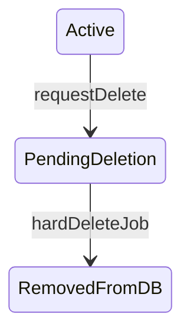

# Workbook async soft delete (design)

**Status:** proposed  
**Date:** 2026-04-13  
**Source:** Design plan for async workbook deletion (see [docs/plans/CLAUDE.md](CLAUDE.md))

## Problem

Today [`WorkbookService.delete`](../../server/src/workbook/workbook.service.ts) performs synchronous cleanup: git repo deletes per connector, workbook repo, file index/reference cleanup, sync/dbJob cleanup, then `workbook.delete`. Large workbooks hit HTTP/CLI timeouts.

## Goals

1. **UI, REST, CLI** “delete workspace” only **flags** the workbook and **enqueues** background work; response returns quickly.
2. **Non-admin users** do not see workbooks flagged for deletion in lists or as navigable workspaces; nested resources (syncs, data folders, etc.) are likewise **invisible / unreachable** (treat as not found).
3. **Admins** (`UserRole.ADMIN` → `actor.isAdmin`, same pool as [`hasAdminToolsPermission`](../../server/src/auth/permissions.ts)) retain access for support; **dev tools** show clear **“pending deletion”** markup.
4. **Async worker** performs the existing hard-delete steps **once** the flag is set.

## Non-goals (unless product asks later)

- User-visible “undo” or restore after flagging.
- Exposing deletion job progress in the main product UI (optional follow-up: link to `/jobs`).

---

## Data model

Add to Prisma `Workbook` in [`server/prisma/schema.prisma`](../../server/prisma/schema.prisma) (keep in sync with [`packages/shared-types/src/db/workbook.ts`](../../packages/shared-types/src/db/workbook.ts)):

- **`isPendingDelete Boolean`** — default `false`. Set to `true` when delete is requested; the async job clears the row when hard delete completes.

**Timestamps:** do **not** add a separate deletion timestamp. The existing **`updatedAt`** on `Workbook` updates whenever the row is saved, including when `isPendingDelete` is flipped to `true`, so it doubles as “when the workbook was last modified” (including flagging for deletion).

Optional: **`deletionRequestedByUserId String?`** for audit/support (FK to `User` optional).

Add an index on `isPendingDelete` if you expect admin queries that filter “all pending” at scale; the worker is **queue-driven**, not polling.

**Migration:** user-generated after schema review (repo rule: do not auto-generate migrations in agent runs).

---

## State machine

- **Hard delete** reuses current [`WorkbookService.delete`](../../server/src/workbook/workbook.service.ts) body (git, index, cascades, `workbook.delete`) but runs **without** a user-facing HTTP deadline, using a **system actor** for audit/analytics where needed.

---

## API behavior

### DELETE `/workbook/:id` and CLI `DELETE cli/v1/workbooks/:id`

- **Authorize** as today (`checkWorkspacePermissions`).
- **Idempotent:** if `isPendingDelete` is already `true`, return success (avoid duplicate Bull jobs).
- **Transactional core:** set `isPendingDelete` to `true` (Prisma will bump **`updatedAt`**), **clear `User.lastWorkbookId`** wherever it points at this workbook (avoid landing users on a disappearing workspace).
- **Enqueue** a dedicated job (see below) with a **deterministic Bull job id** (e.g. `delete-workbook-${workbookId}`) so retries do not stack duplicate work — pattern aligns with [`BullEnqueuerService.enqueueJobWithId`](../../server/src/worker-enqueuer/bull-enqueuer.service.ts).
- **Response:** prefer **`202 Accepted`** with a small JSON body `{ "status": "deletion_scheduled", "workbookId": "..." }` (breaking change vs current `204` — document for CLI and any external clients). Alternative: keep `204` to minimize breakage; product preference should decide.

### GET `/workbook` (list)

- [`findAllForUser` / `findAllForConnectorAccount`](../../server/src/workbook/workbook.service.ts): for **`!actor.isAdmin`**, add `where: { isPendingDelete: false }`.
- **`actor.isAdmin`:** include pending workbooks so admin flows can see them in the standard list (optional; if too noisy, keep list filtered and rely on dev-tools list — **decide with UX**).

### GET `/workbook/:id` (detail)

- After permission check, if **`!actor.isAdmin` and `isPendingDelete`** → **`404`** (avoid leaking existence).
- **`actor.isAdmin`:** return workbook; include **`isPendingDelete`** (boolean) in serialized [`Workbook` entity](../../server/src/workbook/entities/workbook.entity.ts) / shared types. Use existing **`updatedAt`** when a “when was this flagged?” time is needed in UI or support tooling.

Same visibility rules apply to **[MCP `list-workbooks`](../../server/src/mcp/tools/list-workbooks.tool.ts)** and **[code-migrations](../../server/src/code-migrations/code-migrations.controller.ts)** workbook listings — filter or gate consistently.

---

## Nested resources (syncs, data folders, files, …)

**Principle:** any endpoint that implies “this workbook exists for this user” must **fail with 404** for non-admins when the workbook is pending deletion.

Today many services call [`workbookService.findOne(id, actor)`](../../server/src/workbook/workbook.service.ts), but **`findOne` ignores `_actor`** and only checks `id` — so visibility must be enforced explicitly.

**Recommended pattern:** add something like **`WorkbookService.assertReadableWorkbook(actor, workbookId)`** that:

1. Calls existing permission checks (`checkWorkspacePermissions` / `hasWorkspacePermissions`).
2. Loads workbook; if missing → `NotFound`.
3. If **`isPendingDelete`** and **`!actor.isAdmin`** → `NotFound`.
4. Returns cluster for admin (including pending).

Then use this inside [`DataFolderService.listAll`](../../server/src/workbook/data-folder.service.ts), sync controllers, connector flows, etc., replacing or wrapping the current `findOne`+`NotFound` checks. Controllers that only call `checkWorkspacePermissions` should still route through the same assertion so **direct API access** cannot bypass hiding.

**Scheduler:** [`SchedulerService.evaluateSchedules`](../../server/src/schedule/scheduler.service.ts) should **skip** schedules whose `workbookId` refers to a workbook with **`isPendingDelete: true`** (add early check before `enqueueJob` or in `isWorkbookBusy`).

**New user-initiated jobs:** [`BullEnqueuerService`](../../server/src/worker-enqueuer/bull-enqueuer.service.ts) enqueue methods should **reject** (400/409) if workbook is pending deletion, or rely on the same `assertReadableWorkbook` at controller level — avoid queueing long work onto dying workspaces.

---

## Background job

Add a new **`JobType`** entry in [`packages/shared-types/src/job-types.ts`](../../packages/shared-types/src/job-types.ts) and a **job definition + handler** under [`server/src/worker/jobs/job-definitions/`](../../server/src/worker/jobs/job-definitions/) per [worker rules](../../server/src/worker/.cursor/rules/jobs.mdc):

- **Input:** `workbookId` (and minimal context for `DbJob` row: `userId` from requesting user or system).
- **Handler:** invoke extracted **`executeHardDeleteWorkbook(workbookId)`** (current delete body). Use **idempotency:** if workbook row already gone, complete successfully.
- **Register** in [`union-types.ts`](../../server/src/worker/jobs/union-types.ts) and [`JobHandlerService`](../../server/src/worker/job-handler.service.ts).
- **Failure / retry:** BullMQ `attempts` policy TBD (likely low retries + alert; git delete failures are already best-effort logged today).

**Dependency injection:** handler likely needs `WorkbookService` or a slim **`WorkbookDeletionService`** to avoid circular imports; follow patterns from existing job handlers.

---

## Audit, analytics, PostHog

- On **request:** audit log “workspace deletion scheduled” (and optional `deletionRequestedBy`).
- On **job completion:** retain existing “deleted workbook” tracking if still desired, or log “workspace purged after schedule”.

---

## Client

- [`useWorkbooks`](../../client/src/hooks/use-workbooks.ts) / [`workbookApi.delete`](../../client/src/lib/api/workbook.ts): handle **202** and messaging (“Deletion started…”); revalidate list so workspace disappears for non-admins immediately after flagging.
- **Routing:** if user had `lastWorkbookId` cleared server-side, existing redirect logic should pick another workbook or home.
- **Dev tools:** [`client/src/app/settings/dev/workbooks/page.tsx`](../../client/src/app/settings/dev/workbooks/page.tsx) — extend [`AdminWorkbookDto`](../../packages/shared-types) with `isPendingDelete` and show **Badge** / row styling for pending deletion (matches “markup in dev tools”). Optionally show **`updatedAt`** as secondary text when pending (same moment the flag was set, unless something else touched the row afterward).

---

## CLI (Rust)

- [`scratch-git-2/src/cli/commands/workspaces.rs`](../../scratch-git-2/src/cli/commands/workspaces.rs) — adjust success messaging for async delete; parse new JSON if returned.

---

## Testing strategy

- Unit: `assertReadableWorkbook`, list filters, idempotent DELETE.
- Integration: enqueue job + worker processes (or handler unit with mocks); scheduler skips pending workbook.

---

## Rollout / risks

- **Breaking:** HTTP status and body for DELETE; CLI output.
- **Consistency window:** short period where workbook is flagged but git/data still exists — acceptable; admins see state explicitly.
- **Double enqueue:** prevented by deterministic job id + idempotent handler.

---

## Implementation order (suggested)

1. Schema + shared types + `Workbook` entity serialization.
2. Extract `executeHardDeleteWorkbook`; implement `requestDeletion` + job + enqueuer.
3. `assertReadableWorkbook` + update list methods + DELETE controllers (REST + CLI).
4. Sweep controllers/services using workbook id (sync, data folders, files, connectors, schedules, jobs).
5. Dev tools UI + client delete UX.
6. Tests, `yarn build` / `yarn lint` from repo root.

---

## Implementation todos

- [ ] Add `isPendingDelete` to Prisma `Workbook` + shared-types + entity; plan user-run migration
- [ ] Extract hard delete; add requestDeletion, BullMQ DeleteWorkbook job + handler + enqueue with deterministic job id
- [ ] Add assertReadableWorkbook; filter findAll\*; 404 detail for non-admins; scheduler/enqueue guards
- [ ] REST/CLI DELETE 202 + body; MCP/code-migrations; client + dev-tools badge on AdminWorkbookDto
- [ ] Tests + yarn build/lint from repo root
