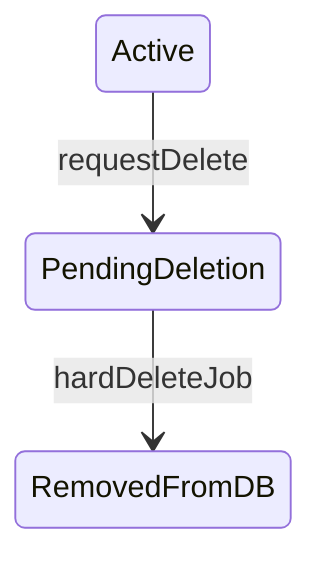

# Workbook async soft delete (design)

**Status:** implemented  
**Date:** 2026-04-13  
**Source:** Design plan for async workbook deletion (see [docs/plans/CLAUDE.md](../../CLAUDE.md))

## Progress

- **Phase 1 — Schema + shared types + entity (2026-04-27).** Added `isPendingDelete Boolean @default(false)` to Prisma `Workbook` ([`server/prisma/schema.prisma`](../../server/prisma/schema.prisma)), to the shared-types `Workbook` interface ([`packages/shared-types/src/db/workbook.ts`](../../packages/shared-types/src/db/workbook.ts)), and to the server [`Workbook` entity](../../server/src/workbook/entities/workbook.entity.ts). Optional `deletionRequestedByUserId` and the `@@index([isPendingDelete])` index were intentionally skipped — revisit if admin "all pending" queries appear. **Migration:** to be applied manually by user (`yarn run migrate` after `prisma migrate dev`).
- **Phase 2 — Hard-delete extraction + job + enqueuer (2026-04-27).** Extracted hard-delete body into [`WorkbookService.executeHardDeleteWorkbook(id, actor = SYSTEM_ACTOR)`](../../server/src/workbook/workbook.service.ts) (idempotent — returns silently if row is already gone). Added [`WorkbookService.requestDeletion(id, actor)`](../../server/src/workbook/workbook.service.ts) which flags the workbook, clears any `User.lastWorkbookId` referencing it, audit-logs the schedule event, and enqueues the job (early-returns if already flagged to avoid stacking `DbJob` rows). New [`DeleteWorkbookJobDefinition` + `DeleteWorkbookJobHandler`](../../server/src/worker/jobs/job-definitions/delete-workbook.job.ts) registered in `union-types.ts` and `JobHandlerService`. New [`BullEnqueuerService.enqueueDeleteWorkbookJob`](../../server/src/worker-enqueuer/bull-enqueuer.service.ts) using deterministic Bull job id `delete-workbook-${workbookId}`.
- **Phase 3 — partial implementation reverted (2026-04-28).** A first attempt at admin-gated visibility was reverted after product feedback. Pivoted to the read/mutation split below: pending workbooks remain readable for everyone; mutations 404; dev-tools exempt.
- **Phases 3–6 — implemented (2026-04-28).**
  - **Visibility helpers.** Added [`WorkbookService.assertReadableWorkbook`](../../server/src/workbook/workbook.service.ts) (returns workbook even when pending) and [`assertWritableWorkbook`](../../server/src/workbook/workbook.service.ts) (NotFound on missing or pending). Both call `checkWorkspacePermissions` first. List queries (`findAllForUser` / `findAllForConnectorAccount`) intentionally do **not** filter pending — clients render the state via `isPendingDelete`.
  - **Workbook controller.** [`WorkbookController`](../../server/src/workbook/workbook.controller.ts) reads use `assertReadableWorkbook`; mutations use `assertWritableWorkbook`. DELETE returns `202 Accepted` with `{ status: 'deletion_scheduled', workbookId }` (or `{ status: 'deleted', workbookId }` on `?force=true`). The `force` opt-in is admin-only in production via `ScratchConfigService.isProductionEnvironment()`.
  - **Nested controllers.** Updated [`DataFolderController`](../../server/src/workbook/data-folder.controller.ts) + [`DataFolderService`](../../server/src/workbook/data-folder.service.ts) (replaced inline `findOne` + `checkWorkspacePermissions` patterns), [`SyncController`](../../server/src/sync/sync.controller.ts), [`ScheduleController`](../../server/src/schedule/schedule.controller.ts), [`FilesController`](../../server/src/workbook/files.controller.ts), [`WorkbookDataGateway`](../../server/src/workbook/workbook.gateway.ts), and the CLI controllers ([`CliWorkbookController`](../../server/src/cli/cli-workbook.controller.ts), [`CliLinkedController`](../../server/src/cli/cli-linked.controller.ts), [`CliSyncController`](../../server/src/cli/cli-sync.controller.ts), [`CliConnectionController`](../../server/src/cli/cli-connection.controller.ts)). The CLI workbook DELETE mirrors the REST controller (force flag + 202 body). [`JobController`](../../server/src/job/job.controller.ts) keeps `checkWorkspacePermissions` only — job history is observable on pending workbooks so users can watch deletion progress.
  - **Defense in depth — BullEnqueuer guard.** Added a private [`assertWorkbookNotPendingDelete`](../../server/src/worker-enqueuer/bull-enqueuer.service.ts) check inside `createAndEnqueue` that throws `NotFoundException` for pending workbooks. The `JobType.DeleteWorkbook` job is exempt. This catches every job-driven mutation transitively — including paths through `PublishPlanController`, `ScratchGitController`, transformer/connector/oauth code — without needing to add `WorkbookService` to those modules (which would create circular imports).
  - **Scheduler.** [`SchedulerService.evaluateSchedules`](../../server/src/schedule/scheduler.service.ts) now skips schedules whose workbook is `isPendingDelete: true` (new private `isWorkbookPendingDelete`). Suppresses fires that the BullEnqueuer guard would reject anyway and avoids churning the scheduled-jobs counters.
  - **Dev tools.** Added `isPendingDelete: boolean` to [`AdminWorkbookDto`](../../packages/shared-types/src/dto/workbook/admin-workbook.dto.ts), populated by [`DevToolsController.getAllWorkbooks`](../../server/src/dev-tools/dev-tools.controller.ts), and a "Pending Deletion" badge on the dev-tools workbook row ([`workbooks/page.tsx`](../../client/src/app/settings/dev/workbooks/page.tsx)). Dev-tools endpoints sit behind `ScratchAuthGuard` + admin checks and operate against `WorkbookService.findOne` (or direct Prisma) rather than the writable assertion, so support flows continue to work on pending workbooks.
  - **Client UX.** New [`DeleteWorkbookResponseDto`](../../packages/shared-types/src/dto/workbook/delete-workbook.dto.ts) shared type. [`workbookApi.delete`](../../client/src/lib/api/workbook.ts) now accepts `{ force?: boolean }` and returns the response shape; [`useWorkbooks.deleteWorkbook`](../../client/src/hooks/use-workbooks.ts) propagates it. The workspace `Delete Workspace` confirm dialog ([`DebugMenu.tsx`](../../client/src/app/workbook/[id]/components/MainPane/DebugMenu.tsx)) was reworded to communicate the async nature, and shows a "Deletion scheduled" notification on success.
  - **Rust CLI.** [`workspaces delete`](../../scratch-git-2/src/cli/commands/workspaces.rs) accepts `--force`, parses the new JSON response, and prints either "Scheduled workspace … for deletion." or "Deleted workspace …" depending on the returned status.
  - **Test helper.** [`deleteWorkspace`](../../scratch-cli-tests/src/helpers.ts) in `scratch-cli-tests` now passes `--force` so cleanup is synchronous and adjacent tests don't race the background delete-workbook job.
  - **Build / lint.** `yarn build` and `yarn lint` pass from the repo root. `cargo build --bin scratchmd` passes after `cargo fmt`.

**Open follow-ups.**
1. **Migration.** User to run `prisma migrate dev` to add the `isPendingDelete` column.
2. **Audit logging for dev-tools mutations on pending workbooks.** Plan calls this out as a rollout safeguard; not yet wired (would need a small interceptor or middleware on the dev-tools controller).
3. **`force=true` test coverage.** New unit/integration tests for the force gating and the read/write split helpers were not added in this pass.

## Problem

Today [`WorkbookService.delete`](../../server/src/workbook/workbook.service.ts) performs synchronous cleanup: git repo deletes per connector, workbook repo, file index/reference cleanup, sync/dbJob cleanup, then `workbook.delete`. Large workbooks hit HTTP/CLI timeouts.

## Goals

1. **UI, REST, CLI** “delete workspace” only **flags** the workbook and **enqueues** background work; response returns quickly.
2. **Reads stay open.** Lists and detail/read endpoints continue to return pending workbooks to every authenticated caller (no admin gate). The serialized [`Workbook` entity](../../server/src/workbook/entities/workbook.entity.ts) exposes **`isPendingDelete`** so clients can render the state (banner, disabled actions, etc.).
3. **Mutations are blocked.** Every mutation endpoint that touches a workbook (or a resource nested under one) responds with **`404 Not Found`** when the workbook is `isPendingDelete: true`. This applies to all callers — **dev-tools endpoints are the only exception** (they need to keep operating on pending workbooks for support flows).
4. **Async worker** performs the existing hard-delete steps **once** the flag is set.

## Non-goals (unless product asks later)

- User-visible “undo” or restore after flagging.
- Exposing deletion job progress in the main product UI (optional follow-up: link to `/jobs`).

---

## Data model

Add to Prisma `Workbook` in [`server/prisma/schema.prisma`](../../server/prisma/schema.prisma) (keep in sync with [`packages/shared-types/src/db/workbook.ts`](../../packages/shared-types/src/db/workbook.ts)):

- **`isPendingDelete Boolean`** — default `false`. Set to `true` when delete is requested; the async job clears the row when hard delete completes.

**Timestamps:** do **not** add a separate deletion timestamp. The existing **`updatedAt`** on `Workbook` updates whenever the row is saved, including when `isPendingDelete` is flipped to `true`, so it doubles as “when the workbook was last modified” (including flagging for deletion).

Optional: **`deletionRequestedByUserId String?`** for audit/support (FK to `User` optional).

Add an index on `isPendingDelete` if you expect admin queries that filter “all pending” at scale; the worker is **queue-driven**, not polling.

**Migration:** user-generated after schema review (repo rule: do not auto-generate migrations in agent runs).

---

## State machine

- **Hard delete** reuses current [`WorkbookService.delete`](../../server/src/workbook/workbook.service.ts) body (git, index, cascades, `workbook.delete`) but runs **without** a user-facing HTTP deadline, using a **system actor** for audit/analytics where needed.

---

## API behavior

### DELETE `/workbook/:id` and CLI `DELETE cli/v1/workbooks/:id`

- **Authorize** as today (`checkWorkspacePermissions`).
- **Idempotent:** if `isPendingDelete` is already `true`, return success (avoid duplicate Bull jobs).
- **Transactional core:** set `isPendingDelete` to `true` (Prisma will bump **`updatedAt`**), **clear `User.lastWorkbookId`** wherever it points at this workbook (avoid landing users on a disappearing workspace).
- **Enqueue** a dedicated job (see below) with a **deterministic Bull job id** (e.g. `delete-workbook-${workbookId}`) so retries do not stack duplicate work — pattern aligns with [`BullEnqueuerService.enqueueJobWithId`](../../server/src/worker-enqueuer/bull-enqueuer.service.ts).
- **Response:** prefer **`202 Accepted`** with a small JSON body `{ "status": "deletion_scheduled", "workbookId": "..." }` (breaking change vs current `204` — document for CLI and any external clients). Alternative: keep `204` to minimize breakage; product preference should decide.
- **`force` opt-in for tests:** accept an optional `force=true` query param (and matching CLI flag) that bypasses the async path and runs `executeHardDeleteWorkbook` synchronously, returning when the workbook row is gone. Required so integration tests and smoke tests can assert on a fully-cleaned workbook without polling for the background job. **Authorization:** gate `force=true` to admins (or a non-prod env flag) so the slow synchronous path is not user-reachable in production. Response shape when forced: `200 OK` with `{ "status": "deleted", "workbookId": "..." }` (or keep `204` — pick one, document it). Test fixtures should default to `force=true` so suites stay fast and deterministic.

### GET `/workbook` (list)

- [`findAllForUser` / `findAllForConnectorAccount`](../../server/src/workbook/workbook.service.ts): **no filtering by `isPendingDelete`**. Pending workbooks stay in the list for every caller. Each entry includes `isPendingDelete` so the client can render appropriately (greyed-out row, badge, etc.).

### GET `/workbook/:id` (detail)

- Standard permission check (`checkWorkspacePermissions`). If the workbook exists, **always return it** — even when `isPendingDelete: true`. The serialized [`Workbook` entity](../../server/src/workbook/entities/workbook.entity.ts) **must include `isPendingDelete`** (boolean). Existing `updatedAt` doubles as “when was this flagged?” for support tooling.

Same rule for **[MCP `list-workbooks`](../../server/src/mcp/tools/list-workbooks.tool.ts)** and **[code-migrations](../../server/src/code-migrations/code-migrations.controller.ts)** workbook listings — return everything, surface `isPendingDelete`.

---

## Nested resources (syncs, data folders, files, …)

**Principle:** **reads** of a workbook or any resource nested under one continue to work while a workbook is pending. **Mutations** (POST/PATCH/PUT/DELETE/job-enqueueing operations) **fail with 404** when the workbook is pending — for everyone. Dev-tools endpoints (`/dev-tools/...`) are the **only** path that can mutate a pending workbook.

Today many services call [`workbookService.findOne(id, actor)`](../../server/src/workbook/workbook.service.ts), but **`findOne` ignores `_actor`** and only checks `id` — so the mutation guard must be enforced explicitly.

**Recommended pattern:** two helpers on `WorkbookService`:

1. **`assertReadableWorkbook(actor, workbookId)`** — used by read endpoints.
   - Calls `checkWorkspacePermissions`.
   - Loads workbook; if missing → `NotFound`.
   - Returns the cluster regardless of `isPendingDelete`.
2. **`assertWritableWorkbook(actor, workbookId)`** — used by mutation endpoints.
   - Calls `checkWorkspacePermissions`.
   - Loads workbook; if missing **or** `isPendingDelete: true` → `NotFound` (avoid leaking the difference).
   - Returns the cluster.

Then use these inside [`DataFolderService.listAll`](../../server/src/workbook/data-folder.service.ts), sync controllers, connector flows, etc., replacing or wrapping the current `findOne`+`NotFound` checks. Controllers that only call `checkWorkspacePermissions` should still route through the appropriate assertion so **direct API access** cannot bypass the mutation block.

**Dev-tools exemption:** dev-tools controllers should call `findOne` directly (or a new `assertReadableWorkbook` variant) — they keep operating on pending workbooks because support flows need to inspect and recover state.

**Scheduler:** [`SchedulerService.evaluateSchedules`](../../server/src/schedule/scheduler.service.ts) should **skip** schedules whose `workbookId` refers to a workbook with **`isPendingDelete: true`** (add early check before `enqueueJob` or in `isWorkbookBusy`).

**New user-initiated jobs:** [`BullEnqueuerService`](../../server/src/worker-enqueuer/bull-enqueuer.service.ts) enqueue methods should **reject** (400/409) if workbook is pending deletion, or rely on the same `assertWritableWorkbook` at controller level — avoid queueing long work onto dying workspaces. The internal `enqueueDeleteWorkbookJob` is exempt (it's the worker driving the deletion).

---

## Background job

Add a new **`JobType`** entry in [`packages/shared-types/src/job-types.ts`](../../packages/shared-types/src/job-types.ts) and a **job definition + handler** under [`server/src/worker/jobs/job-definitions/`](../../server/src/worker/jobs/job-definitions/) per [worker rules](../../server/src/worker/.cursor/rules/jobs.mdc):

- **Input:** `workbookId` (and minimal context for `DbJob` row: `userId` from requesting user or system).
- **Handler:** invoke extracted **`executeHardDeleteWorkbook(workbookId)`** (current delete body). Use **idempotency:** if workbook row already gone, complete successfully.
- **Register** in [`union-types.ts`](../../server/src/worker/jobs/union-types.ts) and [`JobHandlerService`](../../server/src/worker/job-handler.service.ts).
- **Failure / retry:** BullMQ `attempts` policy TBD (likely low retries + alert; git delete failures are already best-effort logged today).

**Dependency injection:** handler likely needs `WorkbookService` or a slim **`WorkbookDeletionService`** to avoid circular imports; follow patterns from existing job handlers.

---

## Audit, analytics, PostHog

- On **request:** audit log “workspace deletion scheduled” (and optional `deletionRequestedBy`).
- On **job completion:** retain existing “deleted workbook” tracking if still desired, or log “workspace purged after schedule”.

---

## Client

- **Workbook entity:** [`Workbook` entity](../../server/src/workbook/entities/workbook.entity.ts) and the shared-types [`Workbook`](../../packages/shared-types/src/db/workbook.ts) interface both expose `isPendingDelete`. Surface it in any client component that renders a workbook (sidebar list, breadcrumbs, settings page) — typical UX is a badge/banner plus disabled "edit" affordances since mutations will 404.
- [`useWorkbooks`](../../client/src/hooks/use-workbooks.ts) / [`workbookApi.delete`](../../client/src/lib/api/workbook.ts): handle **202** and messaging (“Deletion started…”). Revalidate the list so the row immediately renders in the pending state (still visible, marked read-only).
- **Routing:** if user had `lastWorkbookId` cleared server-side, existing redirect logic should pick another workbook or home. Visiting the detail page of a pending workbook should still load (it's a read), but the page should disable editing controls based on `isPendingDelete`.
- **Dev tools:** [`client/src/app/settings/dev/workbooks/page.tsx`](../../client/src/app/settings/dev/workbooks/page.tsx) — extend [`AdminWorkbookDto`](../../packages/shared-types) with `isPendingDelete` and show **Badge** / row styling for pending deletion (matches “markup in dev tools”). Optionally show **`updatedAt`** as secondary text when pending (same moment the flag was set, unless something else touched the row afterward). Dev-tools admin actions remain functional on pending workbooks (server-side bypass).

---

## CLI (Rust)

- [`scratch-git-2/src/cli/commands/workspaces.rs`](../../scratch-git-2/src/cli/commands/workspaces.rs) — adjust success messaging for async delete; parse new JSON if returned.

---

## Testing strategy

- Unit: `assertReadableWorkbook` (returns pending workbooks), `assertWritableWorkbook` (404s on pending), idempotent DELETE, `force=true` gating (admin-only / env-gated), dev-tools mutation bypass.
- Integration: enqueue job + worker processes (or handler unit with mocks); scheduler skips pending workbook; pending workbook still appears in `GET /workbook` and `GET /workbook/:id` with `isPendingDelete: true`; nested mutation endpoints 404 on pending workbooks.
- **Integration + smoke suites use `force=true`** when tearing down workbooks so assertions can run against fully-deleted state without polling for the Bull job. Add a shared helper (e.g. `deleteWorkbookForTest`) so suites do not duplicate the flag.

---

## Rollout / risks

- **Breaking:** HTTP status and body for DELETE; CLI output. Mutation endpoints that previously returned 200/204 on a workbook now return `404` once it's flagged — clients that depended on retrying writes mid-deletion need to surface the new error.
- **Consistency window:** short period where workbook is flagged but git/data still exists — acceptable; reads stay open and clients render the pending state explicitly.
- **Double enqueue:** prevented by deterministic job id + idempotent handler.
- **Dev-tools bypass:** dev-tools mutations skip the `isPendingDelete` guard. Audit-log every dev-tools mutation against a pending workbook so we can investigate "ghost edits" if they happen.

---

## Implementation order (suggested)

1. Schema + shared types + `Workbook` entity serialization (incl. exposing `isPendingDelete` on the entity returned to the client).
2. Extract `executeHardDeleteWorkbook`; implement `requestDeletion` + job + enqueuer.
3. Add `assertReadableWorkbook` (read) and `assertWritableWorkbook` (mutation; 404 on pending). Switch the workbook controller's read endpoints to `assertReadableWorkbook` and mutation endpoints (incl. DELETE → `requestDeletion`) to `assertWritableWorkbook`. DELETE returns `202` + body, with `force=true` opt-in (admin/env-gated).
4. Sweep nested-resource controllers/services using a workbook id — apply the read/write split to sync, data folders, files, connectors, schedules, jobs, publish-plan, scratch-git, transformer, oauth, gateway, and CLI controllers. Confirm dev-tools controllers are exempt from the mutation guard.
5. Scheduler + BullEnqueuerService guards against pending workbooks.
6. Dev tools UI badge (`AdminWorkbookDto`) + client delete UX (`workbookApi`/`useWorkbooks` handle 202; render `isPendingDelete` state in workbook UI).
7. Rust CLI delete command (parse 202 body + `--force` flag).
8. Tests, shared `deleteWorkbookForTest` helper, `yarn build` / `yarn lint` from repo root.

---

## Implementation todos

- [x] Add `isPendingDelete` to Prisma `Workbook` + shared-types + entity; plan user-run migration _(2026-04-27)_
- [x] Extract hard delete; add requestDeletion, BullMQ DeleteWorkbook job + handler + enqueue with deterministic job id _(2026-04-27)_
- [x] Expose `isPendingDelete` on the [`Workbook` entity](../../server/src/workbook/entities/workbook.entity.ts) returned by the workbook controller _(2026-04-28)_
- [x] Add `assertReadableWorkbook` (no pending check) and `assertWritableWorkbook` (404 on pending) on `WorkbookService` _(2026-04-28)_
- [x] Switch workbook controller: reads → `assertReadableWorkbook`; mutations → `assertWritableWorkbook`; DELETE → `requestDeletion` (202 + body) _(2026-04-28)_
- [x] REST/CLI DELETE `force=true` synchronous opt-in (admin/env-gated) + shared `deleteWorkspace` helper for integration & smoke suites _(2026-04-28)_
- [x] Sweep nested-resource controllers/services (sync, data folders, files, schedules, jobs, gateway, CLI) — read vs. write split. Publish-plan / scratch-git / transformer / oauth / connector-account paths covered transitively via the BullEnqueuer guard (avoids circular imports). _(2026-04-28)_
- [x] Scheduler skips schedules whose workbook is pending; `BullEnqueuerService` rejects new user-initiated jobs for pending workbooks (delete-workbook job exempt) _(2026-04-28)_
- [x] Dev-tools exemption: dev-tools controllers continue to operate on pending workbooks via direct Prisma reads / `findOne` _(2026-04-28)_
- [x] Add `isPendingDelete` to `AdminWorkbookDto` + render badge on dev-tools page _(2026-04-28)_
- [x] Client: handle 202 from DELETE in `workbookApi.delete` + `useWorkbooks`; updated workspace delete confirm dialog wording _(2026-04-28)_
- [x] Rust CLI: parse new 202 body + add `--force` flag _(2026-04-28)_
- [x] `yarn build` / `yarn lint` from repo root _(2026-04-28)_
- [ ] Apply Prisma migration (`prisma migrate dev`) — user to run manually per repo convention.
- [ ] Audit logging for dev-tools mutations against pending workbooks.
- [ ] Unit/integration coverage for the read/write split helpers and `force=true` gating.
