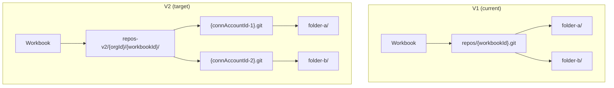
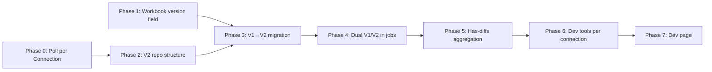

# Repo-per-Connection Architecture Transition Plan

Migrate from 1 git repo per workbook → 1 git repo per connection (ConnectorAccount). During transition, v1 workbooks keep the old single-repo layout and v2 workbooks use the new `repos-v2/{orgId}/{workbookId}/{connectionId}` structure.

## Architecture Overview

---

## Phase 0: Prerequisite — Switch Poll Jobs to per-Connection ✅ DONE

> [!IMPORTANT]
> Currently the `pull-linked-folder-files` job runs per DataFolder (table). We need to consolidate so there is 1 poll job per **ConnectorAccount** (connection) that iterates through all its DataFolders sequentially. This reduces git lock contention and aligns with the API-quota-per-connection model.

### Changes

#### [MODIFY] [workbook.service.ts](file:///Users/ijd/repos/spinner/server/src/workbook/workbook.service.ts)

- Change `pullFiles()` to group DataFolders by `connectorAccountId` and enqueue **one** pull job per connection instead of one per DataFolder.

#### [MODIFY] [pull-linked-folder-files.job.ts](file:///Users/ijd/repos/spinner/server/src/worker/jobs/job-definitions/pull-linked-folder-files.job.ts)

- Accept `dataFolderIds: DataFolderId[]` (array) instead of a single `dataFolderId`.
- Loop through each DataFolder within the job, pulling files for each one sequentially.
- Progress tracking becomes per-folder within the single job.

#### [MODIFY] [bull-enqueuer.service.ts](file:///Users/ijd/repos/spinner/server/src/worker-enqueuer/bull-enqueuer.service.ts)

- Update the pull job enqueue method to accept an array of DataFolderIds.

### Post-implementation cleanup

#### Add `connectorAccountId` to job data

Currently the job data only carries `dataFolderIds`. The contract that all folders belong to one connection is enforced by the caller (`workbook.service.ts` groups by `connectorAccountId` before enqueuing) but nothing validates it at the job level.

Adding `connectorAccountId: string` to the job data would:
- Make the single-connection intent explicit and self-documenting
- Allow the handler to assert upfront that all folder IDs actually belong to the stated connection (fail-fast rather than silent mis-routing)
- Simplify the connector account lookup — it could be fetched once at the top of `run()` rather than re-fetched inside `pullFolder()` on every iteration

**What needs to change:**

- `PullLinkedFolderFilesJobDefinition['data']` — add `connectorAccountId: string`
- `PullLinkedFolderFilesJobHandler.run()` — fetch and validate the connector account once, pass it into `pullFolder()`; assert each folder's `connectorAccountId` matches before processing
- `bull-enqueuer.service.ts` — add `connectorAccountId` parameter to `enqueuePullLinkedFolderFilesJob`
- `workbook.service.ts` — already has the connection key from grouping, pass it through
- `data-folder.service.ts` — `connectorAccountId` is available on the folder object, pass it through
- `publish-data-folder.job.ts` — `dataFolder.connectorAccountId` is available, pass it through
- `scheduler.service.ts` — **requires a DB lookup**: the schedule's `entityId` is a `DataFolderId`, not a connection ID. Would need to fetch the DataFolder first to get its `connectorAccountId` before enqueuing. This is the most significant change required.

---

## Phase 1: Database Schema — Add `version` to Workbook ✅ DONE

### Changes

#### [NEW] Prisma migration

- Add `version Int @default(1)` to the `Workbook` model in [schema.prisma](file:///Users/ijd/repos/spinner/server/prisma/schema.prisma).
- Run migration. All existing workbooks default to version 1.

#### [MODIFY] [workbook.entity.ts](file:///Users/ijd/repos/spinner/server/src/workbook/entities/workbook.entity.ts)

- Expose `version` field on the entity class.

#### [MODIFY] Shared types (`@spinner/shared-types`)

- Add `version` to the `Workbook` type so the client receives it.

---

## Phase 2: V2 Repo Structure in scratch-git

The key change: the **repoId** passed to scratch-git becomes a **path** like `orgId/workbookId/connAccountId` instead of a flat `workbookId`. The scratch-git-2 Rust backend already constructs repo paths as `{repos_dir}/{id}.git`, so passing a path-like ID creates nested directories naturally (e.g. `repos-v2/org123/wb456/conn789.git`).

### Changes

#### [NEW] V2 repo directory config

- Add a `GIT_REPOS_V2_DIR` env var (default `repos-v2`) alongside the existing `GIT_REPOS_DIR`.
- The scratch-git-2 backend should support both dirs. V1 repos live in `repos/`, V2 in `repos-v2/`.

#### [MODIFY] [config.rs](file:///Users/ijd/repos/spinner/scratch-git-2/src/config.rs)

- Add `repos_v2_dir` field to Config.

#### [MODIFY] [state.rs](file:///Users/ijd/repos/spinner/scratch-git-2/src/state.rs)

- Store both `repos_dir` and `repos_v2_dir`. Add a method `repo_path_v2(org_id, workbook_id, conn_id)` that constructs `{repos_v2_dir}/{org_id}/{workbook_id}/{conn_id}.git`.

#### [MODIFY] Route handlers in scratch-git-2

- Routes already accept an `id` path param. For V2, the caller will pass `{orgId}/{workbookId}/{connAccountId}` as the repo identifier. Since the existing glob routes (`/:repoId.git/*` in the HTTP backend) won't match multi-segment IDs, we'll need to add V2-specific route variants.
- **Alternative simpler approach**: Use a flat composite ID like `{orgId}--{workbookId}--{connAccountId}` and map it to the nested directory structure in the Rust backend. This avoids route changes.

> [!NOTE]
> Recommend the flat composite ID approach: `{orgId}--{workbookId}--{connAccountId}`. The Rust backend splits on `--` and maps to the nested dir structure. Simpler to implement, no route changes needed.

#### [MODIFY] [scratch-git.client.ts](file:///Users/ijd/repos/spinner/server/src/scratch-git/scratch-git.client.ts)

- All methods currently take `repoId: string`. No signature change needed — the caller will just pass V2-format IDs.

#### [MODIFY] [scratch-git.service.ts](file:///Users/ijd/repos/spinner/server/src/scratch-git/scratch-git.service.ts)

- Add a helper `getRepoId(workbookVersion, workbookId, orgId?, connAccountId?)` that returns the correct repoId format based on version.
- All methods get overloads or a new V2 variant that accept connection-level identifiers.

---

## Phase 3: V1→V2 Migration Logic

### Changes

#### [NEW] [migration.service.ts](file:///Users/ijd/repos/spinner/server/src/scratch-git/migration.service.ts)

Migration function: `migrateWorkbookToV2(workbookId, orgId)`

Steps:

1. Fetch all ConnectorAccounts for the workbook.
2. For each ConnectorAccount:
   a. Init a new V2 repo at `repos-v2/{orgId}/{workbookId}/{connAccountId}.git`.
   b. Get all DataFolders belonging to this ConnectorAccount.
   c. For each DataFolder, read all files from main and dirty branches in the V1 repo (filtered to the folder's `path`).
   d. Commit those files into the new V2 repo on main branch.
   e. If there were dirty diffs for that folder, commit them to dirty branch; otherwise point dirty at main.
3. Update the Workbook's `version` to 2 in the database.
4. **Do NOT delete the V1 repo yet** — keep it as a fallback until we're confident.

> [!WARNING]
> DataFolders without a `connectorAccountId` (scratch folders) need a home. They should go into a "default" repo, e.g. keyed as `{orgId}--{workbookId}--_scratch_`.

---

## Phase 4: Backend — Dual V1/V2 Support in Jobs & Services

### Changes

#### [MODIFY] [scratch-git.service.ts](file:///Users/ijd/repos/spinner/server/src/scratch-git/scratch-git.service.ts)

- Every method that currently takes `workbookId: WorkbookId` needs to resolve the correct repoId based on workbook version. Two approaches:
  - **Option A (simpler, recommended for now):** Callers pass the resolved repoId string directly. Add a utility function that callers use to build the repoId.
  - **Option B:** Service fetches workbook version internally (requires DB access in the service).
- Recommend **Option A** — keep the service stateless, push resolution to the caller.

#### [MODIFY] [pull-linked-folder-files.job.ts](file:///Users/ijd/repos/spinner/server/src/worker/jobs/job-definitions/pull-linked-folder-files.job.ts)

- Resolve workbook version from DB.
- For V2: use `{orgId}--{workbookId}--{connAccountId}` as repoId when calling scratchGitService methods.
- Files no longer need folder-path prefixes in V2 repos (each repo is scoped to one connection), but we should keep the folder paths for consistency during transition.

#### [MODIFY] [publish-data-folder.job.ts](file:///Users/ijd/repos/spinner/server/src/worker/jobs/job-definitions/publish-data-folder.job.ts)

- Same pattern: resolve workbook version, use V2 repoId when applicable.

#### [MODIFY] [sync-data-folders.job.ts](file:///Users/ijd/repos/spinner/server/src/worker/jobs/job-definitions/sync-data-folders.job.ts)

- Same pattern.

#### [MODIFY] [workbook.controller.ts](file:///Users/ijd/repos/spinner/server/src/workbook/workbook.controller.ts)

- `discardChanges` and `reset` need to operate on all connection repos for V2 workbooks.

#### [MODIFY] [workbook.service.ts](file:///Users/ijd/repos/spinner/server/src/workbook/workbook.service.ts)

- `delete` should delete all V2 repos when removing a V2 workbook.
- `pullFiles` should resolve to per-connection repos for V2.

---

## Phase 5: "Has Diffs" Red Dot — Aggregated Across Connection Repos

### Changes

#### [MODIFY] [scratch-git.controller.ts](file:///Users/ijd/repos/spinner/server/src/scratch-git/scratch-git.controller.ts)

- Add a new V2 endpoint: `GET :workbookId/v2/has-dirty` that:
  1. Looks up all ConnectorAccounts for the workbook.
  2. Calls `hasDirtyFiles` on each connection repo.
  3. Returns `hasDirty: true` if ANY repo has diffs.
- Alternatively, track OIDs (main vs dirty head commit) per connection in the DB and compare without hitting git.

#### [MODIFY] [workbook.ts (client API)](file:///Users/ijd/repos/spinner/client/src/lib/api/workbook.ts)

- `hasDirtyFiles()` should call the V2 endpoint for V2 workbooks.

#### [MODIFY] [NavTabs.tsx](file:///Users/ijd/repos/spinner/client/src/app/workbook/[id]/components/Sidebar/NavTabs.tsx)

- Uses `workbookApi.hasDirtyFiles(workbookId)`. Response shape stays the same, the backend handles the aggregation.

---

## Phase 6: Git Dev Tools — Move to Connection Level

Currently the dev tools (GC, graph, object counts, file browser, etc.) are on the Workbook. For V2, they should be per-connection.

### Changes

#### [MODIFY] [scratch-git.controller.ts](file:///Users/ijd/repos/spinner/server/src/scratch-git/scratch-git.controller.ts)

- Add V2 routes that accept `connectionId` and resolve to the connection repo:
  - `GET v2/:orgId/:workbookId/:connAccountId/list`
  - `GET v2/:orgId/:workbookId/:connAccountId/graph`
  - `POST v2/:orgId/:workbookId/:connAccountId/gc`
  - `GET v2/:orgId/:workbookId/:connAccountId/object-counts`
  - etc.
- Keep V1 routes as-is for backward compatibility.

#### Client UI

- For V2 workbooks, the "⋮" menu items (File browser, GC, Git Tree, etc.) move from the workbook header to the connection/ConnectorAccount component.
- Clicking these passes `orgId/workbookId/connAccountId` to the API instead of just `workbookId`.

---

## Phase 7: Dev Page — Workbooks Admin ✅ DONE (partial)

### Changes

#### [NEW] Dev Page Component (client)

- Page at `/settings/dev/workbooks` listing all workbooks for the current user.
- Columns: **ID**, **Name**, **Version (v1/v2)**, **Created**, **→V2 button**.
- The →V2 button is currently disabled (placeholder). It will call the migration endpoint created in Phase 3.
- Link added to `/settings/user` under the Dev Tools section (visible only when dev tools are enabled).

#### [NEW] Migration endpoint (server)

- `POST /scratch-git/migrate-to-v2/:workbookId` — calls the migration service. (Not yet implemented — depends on Phase 3.)

---

## Summary of Phases & Dependencies

| Phase | Effort   | Can be done in parallel? |
| ----- | -------- | ------------------------ |
| 0     | 1-2 days | Independent              |
| 1     | 0.5 day  | Independent              |
| 2     | 1-2 days | After Phase 1            |
| 3     | 1-2 days | After Phase 1 + 2        |
| 4     | 2-3 days | After Phase 2 + 3        |
| 5     | 1 day    | After Phase 4            |
| 6     | 1-2 days | After Phase 4            |
| 7     | 1 day    | After Phase 1            |

**Total estimated effort: ~8-13 days**

---

## Key Design Decisions Needing Confirmation

1. **Repo ID format**: Recommend flat composite `{orgId}--{workbookId}--{connAccountId}` mapped to nested dirs in Rust backend. Alternative: multi-segment path IDs requiring route changes.
2. **Scratch folders** (no connector): Put them in a `_scratch_` pseudo-connection repo? Or keep them in a workbook-level repo?
3. **V1 repo cleanup**: When to delete old V1 repos after migration? Suggest a grace period + manual cleanup via dev page.
4. **Phase 0 scope**: How much of the poll-job consolidation do you want before starting the repo migration? Could be done as a separate PR.

---

## Verification Plan

### Automated Tests

- Existing test: [pull-linked-folder-files.job.spec.ts](file:///Users/ijd/repos/spinner/server/src/worker/jobs/job-definitions/pull-linked-folder-files.job.spec.ts) — update to cover the per-connection pull job changes.
- New test: Migration service unit test — verify files are cloned correctly from V1 to V2 repos.
- New test: V2 repoId resolution — verify composite ID → nested path mapping.

### Manual Verification

1. Create a V1 workbook with 2+ connections. Verify it works as before.
2. Click "→V2" on the dev page. Verify:
   - `repos-v2/{orgId}/{workbookId}/` directory is created with one `.git` repo per connection.
   - Files from V1 are present in the correct V2 repos.
   - Workbook version is now 2 in the DB.
3. Pull files on the V2 workbook. Verify files go to the correct connection repo.
4. Make edits (dirty changes). Verify the red dot appears.
5. Publish from a V2 workbook. Verify publish reads from the correct connection repo.
6. Test git dev tools (GC, graph, file browser) on a V2 connection.
