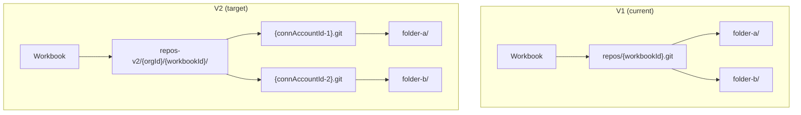
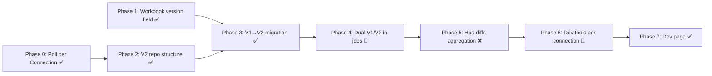

# Repo-per-Connection Architecture Transition Plan

Migrate from 1 git repo per workbook → 1 git repo per connection (ConnectorAccount). During transition, v1 workbooks keep the old single-repo layout and v2 workbooks use the new `repos-v2/{orgId}/{workbookId}/{connectionId}` structure.

## Architecture Overview

---

## Phase 0: Prerequisite — Switch Poll Jobs to per-Connection ✅ DONE

> [!IMPORTANT]
> Currently the `pull-linked-folder-files` job runs per DataFolder (table). We need to consolidate so there is 1 poll job per **ConnectorAccount** (connection) that iterates through all its DataFolders sequentially. This reduces git lock contention and aligns with the API-quota-per-connection model.

### Changes

#### [MODIFY] [workbook.service.ts](file:///Users/ijd/repos/spinner/server/src/workbook/workbook.service.ts) ✅

- `pullFiles()` groups DataFolders by `connectorAccountId` and enqueues **one** pull job per connection.

#### [MODIFY] [pull-linked-folder-files.job.ts](file:///Users/ijd/repos/spinner/server/src/worker/jobs/job-definitions/pull-linked-folder-files.job.ts) ✅

- Accepts `dataFolderIds: DataFolderId[]` (array), iterates through each folder sequentially.

#### [MODIFY] [bull-enqueuer.service.ts](file:///Users/ijd/repos/spinner/server/src/worker-enqueuer/bull-enqueuer.service.ts) ✅

- Enqueue method accepts an array of DataFolderIds.

### Post-implementation cleanup — Add `connectorAccountId` to job data ⏳ PENDING

Currently the job data only carries `dataFolderIds`. The connection is enforced by the caller but not validated at the job level.

Adding `connectorAccountId: string` to the pull job data would:
- Make the single-connection intent explicit and self-documenting
- Allow the handler to assert upfront that all folder IDs actually belong to the stated connection
- Simplify connector account lookup — fetch once at the top of `run()` rather than per-folder

**What needs to change:**

- `PullLinkedFolderFilesJobDefinition['data']` — add `connectorAccountId: string`
- `PullLinkedFolderFilesJobHandler.run()` — fetch and validate the connector account once; assert each folder's `connectorAccountId` matches
- `bull-enqueuer.service.ts` — add `connectorAccountId` parameter to `enqueuePullLinkedFolderFilesJob`
- `workbook.service.ts` — already has the connection key from grouping, pass it through
- `data-folder.service.ts` — `connectorAccountId` is available on the folder object, pass it through
- `publish-data-folder.job.ts` — `dataFolder.connectorAccountId` is available, pass it through
- `scheduler.service.ts` — **requires a DB lookup**: fetch the DataFolder first to get its `connectorAccountId`

---

## Phase 1: Database Schema — Add `version` to Workbook ✅ DONE

#### [NEW] Prisma migration ✅

- `version Int @default(1)` added to the `Workbook` model.

#### [MODIFY] [workbook.entity.ts](file:///Users/ijd/repos/spinner/server/src/workbook/entities/workbook.entity.ts) ✅

#### [MODIFY] Shared types (`@spinner/shared-types`) ✅

---

## Phase 2: V2 Repo Structure in scratch-git ✅ DONE

Flat composite ID `{orgId}--{workbookId}--{connAccountId}` is used. The Rust backend splits on `--` and maps to the nested directory structure.

#### [MODIFY] [scratch-git.service.ts](file:///Users/ijd/repos/spinner/server/src/scratch-git/scratch-git.service.ts) ✅

- `getRepoId(version, workbookId, orgId, connAccountId)` — builds the correct flat composite ID.
- `resolveRepoId(workbookId, connectorAccountId?)` — async resolver that DB-looks up workbook version and returns the appropriate repoId.

---

## Phase 3: V1→V2 Migration Logic ✅ DONE

#### [NEW] [migration.service.ts](file:///Users/ijd/repos/spinner/server/src/scratch-git/migration.service.ts) ✅

`migrateWorkbookToV2(workbookId)` steps:
1. For each ConnectorAccount: init a new V2 repo, commit all main-branch files.
2. Call `rebaseDirty` so dirty branches off new main HEAD (not the initial commit).
3. Commit only dirty-delta files (files that differ between V1 dirty and V1 main).
4. Update `Workbook.version` to 2.
5. V1 repo is preserved as fallback.

#### [NEW] Migration endpoint ✅

- `POST /scratch-git/:id/migrate-to-v2` — calls `MigrationService.migrateWorkbookToV2()`.

---

## Phase 4: Backend — Dual V1/V2 Support in Jobs & Services 🔶 PARTIAL

### What's done ✅

#### [MODIFY] [pull-linked-folder-files.job.ts](file:///Users/ijd/repos/spinner/server/src/worker/jobs/job-definitions/pull-linked-folder-files.job.ts) ✅

- Fetches workbook version at the start of the job.
- Uses `getRepoId()` to compute the correct V2 composite repoId per connection.
- Initialises V2 repo if it doesn't exist yet (e.g. first pull after connection create).

#### [MODIFY] [scratch-git.controller.ts](file:///Users/ijd/repos/spinner/server/src/scratch-git/scratch-git.controller.ts) ✅ (partial)

The following endpoints accept an optional `connectorAccountId` query param and call `resolveRepoId()`:
- `listRepoFiles`, `getRepoFile`, `getGraph`, `rebaseDirty`, `getObjectCounts`, `runGitGc`

#### [MODIFY] [workbook.service.ts](file:///Users/ijd/repos/spinner/server/src/workbook/workbook.service.ts) ✅

- `resetWorkbook` — loops over all connector accounts, resolves and deletes/re-inits each V2 repo.
- `delete` — deletes all V2 repos for a V2 workbook.

#### [MODIFY] [connector-account.service.ts](file:///Users/ijd/repos/spinner/server/src/remote-service/connector-account/connector-account.service.ts) ✅

- `create()` — for V2 workbooks, immediately inits the V2 git repo for the new connection.
- `resetConnection()` — deletes and re-inits the V2 repo for a single connection; deletes all data folders.

### What's still missing ❌

#### [MODIFY] [scratch-git.controller.ts](file:///Users/ijd/repos/spinner/server/src/scratch-git/scratch-git.controller.ts)

The following endpoints still use plain `workbookId` with no V2 awareness:
- `hasDirtyFiles` — **critical**: drives the red dot in the UI
- `getRepoStatus` — used for diff count display
- `getRepoStatusCount` — used for diff badge
- `getFileDiff` — used for per-file diff view

All four need the same `connectorAccountId` query param + `resolveRepoId()` treatment already applied to the others.

#### [MODIFY] [publish-data-folder.job.ts](file:///Users/ijd/repos/spinner/server/src/worker/jobs/job-definitions/publish-data-folder.job.ts) ❌

- Calls `dataFolderPublishingService.publishAll(workbookId, ...)` with plain `workbookId`.
- The publishing service internally calls scratch-git with the bare workbookId.
- **Required**: threading `connectorAccountId` through the job → service → scratch-git call chain.

#### [MODIFY] [data-folder-publishing.service.ts](file:///Users/ijd/repos/spinner/server/src/workbook/data-folder-publishing.service.ts) ❌

- `publishAll()`, `getFolderDiff()`, and all scratch-git calls use plain `workbookId`.
- Needs a `connectorAccountId` parameter threaded through so it can call `resolveRepoId()`.

#### [MODIFY] [sync-data-folders.job.ts](file:///Users/ijd/repos/spinner/server/src/worker/jobs/job-definitions/sync-data-folders.job.ts) ❌

- Calls `syncService.syncTableMapping(workbookId, ...)` with plain `workbookId`.
- Also calls `scratchGitService.runGitGc(workbookId)` without V2 routing.

#### [MODIFY] [sync.service.ts](file:///Users/ijd/repos/spinner/server/src/sync/sync.service.ts) ❌

- `syncTableMapping()` calls `dataFolderService.getFileContentsByFolderIdPaginated()` with bare `workbookId`.
- The data-folder service never receives `connectorAccountId` to pass to scratch-git.
- **Required**: same connectorAccountId threading as the publish path.

> [!NOTE]
> **Suggested approach for publish & sync**: Rather than threading connectorAccountId through every call, consider having each service resolve it internally — the DataFolder already has `connectorAccountId` on it, so the services can call `resolveRepoId(workbookId, dataFolder.connectorAccountId)` without needing the caller to pass it explicitly.

---

## Phase 5: "Has Diffs" Red Dot — Aggregated Across Connection Repos ❌ NOT STARTED

The red dot in the sidebar currently calls `hasDirtyFiles(workbookId)` which checks only the V1 repo.

### Changes needed

#### [MODIFY] [scratch-git.controller.ts](file:///Users/ijd/repos/spinner/server/src/scratch-git/scratch-git.controller.ts)

- `hasDirtyFiles` needs V2 handling: resolve all connector accounts for the workbook, call `hasDirtyFiles` on each V2 repo, return `hasDirty: true` if **any** repo has diffs.
- Same for `getRepoStatusCount` (drives the diff badge): sum counts across all V2 repos.

> [!NOTE]
> **Suggested optimisation**: Cache the main/dirty HEAD OIDs per connection repo in a DB column (updated after each pull/publish). The "has dirty" check becomes a cheap DB comparison (no git call needed). This would also make the aggregation trivial: `WHERE mainOid != dirtyOid AND workbookId = ?`.

#### [MODIFY] [workbook.ts (client API)](file:///Users/ijd/repos/spinner/client/src/lib/api/workbook.ts)

- `hasDirtyFiles()` — no client change needed; the backend handles aggregation transparently.

---

## Phase 6: Git Dev Tools — Move to Connection Level 🔶 PARTIAL

### What's done ✅

#### Client UI — TreeNode.tsx ✅

- `ConnectionNode` and `EmptyConnectionNode` both render a Git Tools submenu with the full set of dev tools.
- All git tool modals (`GitGraphModal`, `GitFileBrowserModal`, `GitGcModal`, `GitObjectCountsModal`) receive `connectorAccountId` for V2 connections.
- The client-side API calls for `getGraph`, `listRepoFiles`, `getRepoFile`, `getObjectCounts`, `runGitGc`, `rebaseDirty` all pass `connectorAccountId`.

### What's still missing ❌

The workbook-level `DebugMenu` still uses only `workbookId` for the same tools. For V2 workbooks it should either be hidden/disabled or delegate to the per-connection tools in the sidebar. Currently it remains functional because the scratch-git controller falls back to V1 behaviour when no `connectorAccountId` is provided.

---

## Phase 7: Dev Page — Workbooks Admin ✅ DONE

### What's done ✅

- `/settings/dev/workbooks` page with:
  - Cross-org workbook listing via `GET /dev-tools/workbooks` (admin-only)
  - Columns: ID, Name, Org, Connections (count + service icons), Version, Created, Actions
  - Connections modal (click count cell to pop out a table of connections)
  - Text search (filters by workbook name or org name)
  - Connector service multiselect filter with AND/OR mode toggle
  - Configurable page size (1 / 10 / 20 / 25 / 100 / 1000)
  - Pagination
  - **→V2** migration button per V1 workbook

- `POST /scratch-git/:id/migrate-to-v2` migration endpoint ✅

- **Migrate to V2** menu item in the workbook `⋮` menu (admin-only, V1 workbooks only) ✅

- **New Project (V2)** option in the project switcher dropdown (admin-only) ✅

- **Reset Connection** context menu item on connection nodes ✅

---

## Remaining Work — Priority Order

### P1 — Critical (V2 workbooks silently broken without these)

1. **`hasDirtyFiles` / `getRepoStatusCount` V2 aggregation** (Phase 5)
   - Without this the red dot never lights up for V2 workbooks.

2. **Publish path V2 routing** (Phase 4)
   - `publish-data-folder.job.ts` → `data-folder-publishing.service.ts` → scratch-git
   - V2 workbooks cannot publish until this is done.

3. **Sync path V2 routing** (Phase 4)
   - `sync-data-folders.job.ts` → `sync.service.ts` → `data-folder.service.ts` → scratch-git
   - V2 workbooks cannot sync until this is done.

### P2 — Important (UI gaps)

4. **`getRepoStatus` / `getFileDiff` V2 routing** in scratch-git.controller.ts
   - Diff views are broken for V2 workbooks.

5. **Workbook-level `DebugMenu` for V2**
   - The workbook `⋮` menu git tools operate on the V1 repo even for V2 workbooks.
   - Options: hide them for V2 (tools already exist per-connection), or add a connection picker.

### P3 — Nice to have / cleanup

6. **`connectorAccountId` in pull job data** (Phase 0 cleanup)
   - Makes intent explicit and enables upfront validation.

7. **V1 repo cleanup tooling**
   - A button or script to delete old V1 repos after confirming the V2 migration is stable.
   - Could live on the dev admin page alongside the →V2 button.

8. **Scratch folders** (no `connectorAccountId`)
   - Currently untested in V2 context. Decide: keep in V1 repo fallback, or assign to a `_scratch_` pseudo-connection repo.

---

## Summary of Phases & Dependencies

| Phase | Status | Notes |
| ----- | ------ | ----- |
| 0 | ✅ Done | Pull jobs consolidated per-connection; connectorAccountId in job data pending |
| 1 | ✅ Done | `version` field on Workbook |
| 2 | ✅ Done | `getRepoId` / `resolveRepoId` helpers; composite ID format |
| 3 | ✅ Done | Migration service + endpoint; dirty branch parent fix |
| 4 | 🔶 Partial | Pull job ✅; publish & sync paths ❌; most scratch-git controller endpoints ✅; hasDirtyFiles/getRepoStatus/getFileDiff ❌ |
| 5 | ❌ Not started | hasDirtyFiles aggregation across per-connection repos |
| 6 | 🔶 Partial | Per-connection git tools in sidebar ✅; workbook-level DebugMenu not V2-aware ❌ |
| 7 | ✅ Done | Full admin page with search, filters, migration button |
