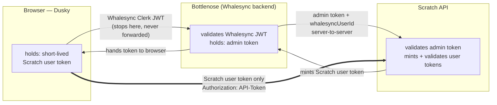
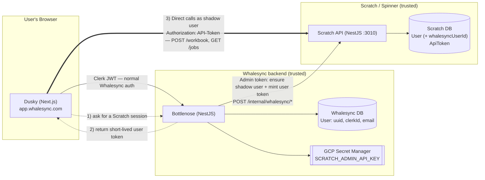
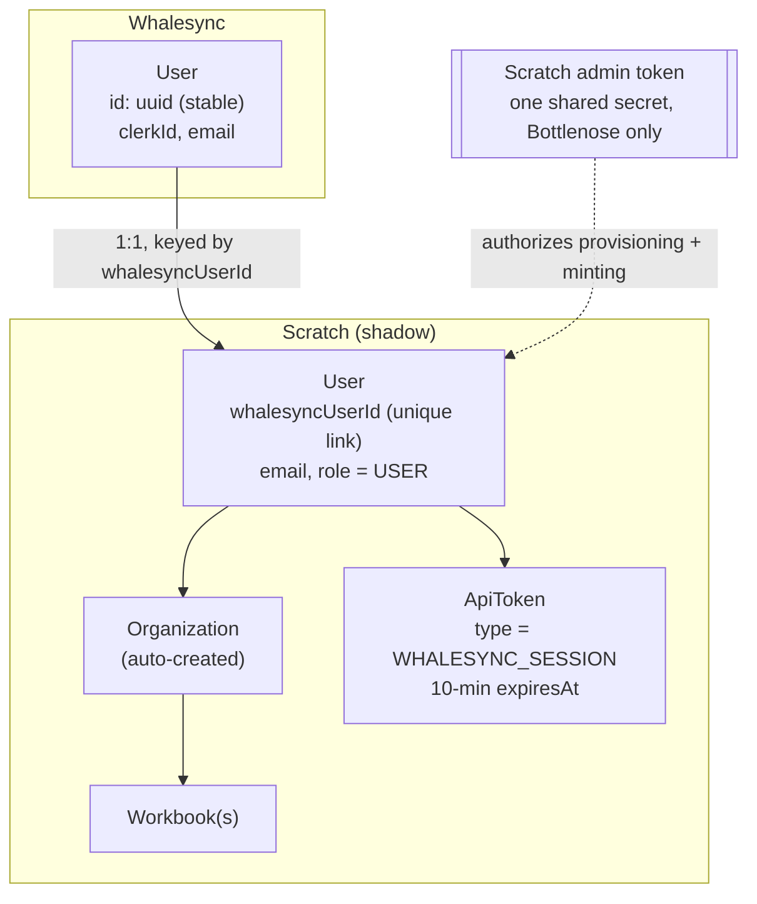
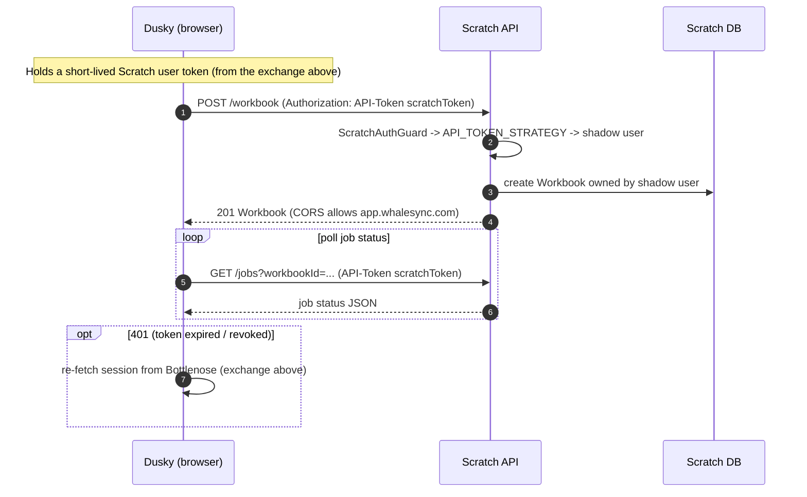
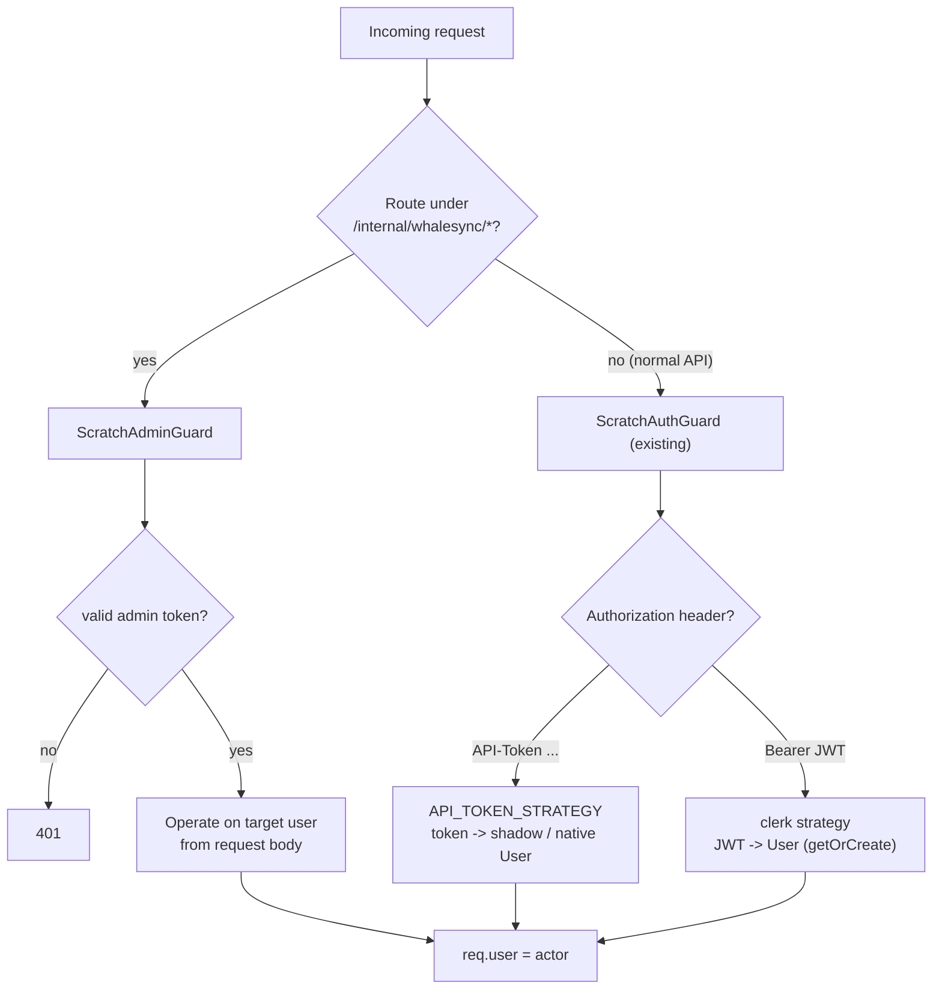

# Whalesync → Scratch: Direct API Access for Dusky

> **Status:** Draft (for refinement)
> **Author:** Chris Hoefgen
> **Created:** 2026-06-04
> **Linear:** [DEV-10325 — WS→Scratch Auth system](https://linear.app/whalesync/issue/DEV-10325/ws-scratch-auth-system)

## Problem

We want Whalesync users to drive Scratch directly from the Whalesync product. Concretely, the Whalesync UI (**Dusky**, a Next.js app at `app.whalesync.com`) should be able to create Scratch workbooks, read job status, and otherwise call the Scratch API **as the acting Whalesync user**, without that user ever signing up for or logging into Scratch separately.

To make this work, every Whalesync user gets a **shadow user** in the Scratch database, and Scratch must be able to authorize requests that originate in the Whalesync product and resolve them to the correct shadow user.

### Hard constraint: Whalesync and Scratch use separate Clerk applications

Whalesync and Scratch each authenticate with **their own, separate Clerk application**, and they must stay separate for now. The implications drive the entire design:

- A Whalesync user's JWT is signed by Whalesync's Clerk app; a Scratch user's JWT is signed by Scratch's Clerk app. They have different signing keys, issuers, and audiences.
- Scratch's Clerk strategy validates against **Scratch's** Clerk keys, so a Whalesync JWT presented to Scratch fails signature / `iss` / `aud` validation. **A Whalesync JWT cannot authenticate to Scratch.**
- Therefore Dusky cannot simply forward its Whalesync session to Scratch. It must present a credential that **Scratch itself issued**.

## Goals

- Every Whalesync user maps 1:1 to a Scratch shadow user, created on demand.
- Dusky calls the Scratch API **directly** (browser → Scratch), authenticated as the shadow user.
- The Whalesync backend (**Bottlenose**) can call Scratch in two modes:
  - **User-scoped** — acting as a specific shadow user.
  - **Admin** — privileged operations like shadow-user creation and token minting.
- Reuse Scratch's existing per-user API-token auth; keep the two Clerk identity domains fully isolated.

## Non-goals (for v1)

- Sharing a Clerk tenant or any SSO/identity federation between the two products.
- Mapping Whalesync **teams/orgs** to shared Scratch organizations. Each shadow user gets its own auto-created Scratch org; cross-user workbook sharing is out of scope for v1 (see [Decision status](#decision-status)).
- Proxying every Scratch call through Bottlenose (we explicitly want direct browser → Scratch; the proxy is noted only as an alternative).

## Core concept: swap the Whalesync JWT for a Scratch-native token

Dusky **never** sends its Whalesync JWT to Scratch. Instead it presents a short-lived **Scratch-issued API token** that was brokered to it through Bottlenose. The two Clerk JWTs never meet.

There are three credentials, and each is validated by exactly the one party that can validate it — none crosses a trust boundary it cannot be verified at:

| Credential               | Issued by                  | Presented to        | Validated by                         | Reaches Scratch?         |
| ------------------------ | -------------------------- | ------------------- | ------------------------------------ | ------------------------ |
| Whalesync Clerk JWT      | Whalesync's Clerk          | Bottlenose          | **Bottlenose** (Whalesync's Clerk)   | ❌ never                  |
| Scratch admin token      | Scratch (shared secret)    | Scratch `/internal/*` | **Scratch** `ScratchAdminGuard`    | server-to-server only    |
| Scratch user token (`ApiToken`) | **Scratch**, bound to shadow user | Scratch `/workbook`, `/jobs` | **Scratch** `API_TOKEN_STRATEGY` | ✅ the browser carries this |

The trust bridge is the **admin channel** (Bottlenose → Scratch), which is server-to-server and never sees the browser. Bottlenose is the only party that can validate the Whalesync identity, so it does that once, then vouches for the user to Scratch over the admin token. The output — a Scratch-native `ApiToken` already bound to the shadow user — is the only thing the browser ever presents to Scratch.



## Architecture: system context



The browser never holds the admin token. Bottlenose is the only thing that can provision or mint. Dusky talks to Scratch directly for the actual work; Bottlenose is just the broker that hands out a short-lived user token.

## Identity model: the shadow user

Key the shadow user on the **Whalesync user UUID** — it is immutable, unlike email, and unambiguous, unlike `clerkId` (which belongs to a different Clerk tenant). Add one unique field to Scratch's `User`:

```prisma
model User {
  // ... existing fields ...
  clerkId         String? @unique   // existing column: real Clerk ID (user_…) for native users; synthetic "ws_<whalesyncUserId>" for shadow users
  whalesyncUserId String? @unique   // UUID of the linked Whalesync user; null for native Scratch users
}

model ApiToken {
  // ... existing fields ...
  type String @default("USER")      // add a "WHALESYNC_SESSION" value for browser session tokens
}
```



- `whalesyncUserId` keeps shadow users distinct from native Scratch signups and makes provisioning idempotent.
- **Synthetic Clerk ID.** Scratch's `User.clerkId` is `@unique` and is populated by the existing creation routine, so each shadow user is given a generated one — prefixed `ws_`, concretely `ws_<whalesyncUserId>` — to differentiate it from a real Clerk ID (Clerk issues `user_…`). The prefix doubles as a discriminator: any server code that would otherwise call Clerk for a user can skip those whose `clerkId` starts with `ws_`, since they don't exist in Scratch's Clerk app. Deriving it from the Whalesync UUID keeps it unique and idempotent. The existing routine stamps the same `clerkId` on the auto-created Organization.
- A `WHALESYNC_SESSION` token type lets these browser tokens get a short (10-minute) TTL, **bypass the API rate limiter**, and be revoked in bulk without touching a user's CLI/desktop tokens. v1 does **not** enforce `ApiToken.scopes`; the token type itself is the flag.
- Provisioning reuses the **same** path Scratch runs today on first Clerk login (`getOrCreateUserFromClerk` → create User + Organization + default Workbook in `spinner/server/src/users/users.service.ts`). The only difference is the trigger: an explicit admin call instead of a JWT side effect.
- 1 Whalesync user → 1 shadow user → 1 auto-created Scratch org. Cross-user workbook sharing is out of scope for v1.

## The two Bottlenose → Scratch channels

| Channel              | Credential                       | Used for                                                                 | Auth on Scratch                         |
| -------------------- | -------------------------------- | ------------------------------------------------------------------------ | --------------------------------------- |
| **Admin**            | Single shared secret, Bottlenose-only | Ensure/create shadow users, mint user tokens, deprovision           | **new** `ScratchAdminGuard`             |
| **User-scoped**      | A shadow user's `ApiToken`       | Any operation acting as that user (also what the browser carries)        | **existing** `API_TOKEN_STRATEGY`       |

The admin secret lives only in Bottlenose, loaded from GCP Secret Manager (the existing pattern in `whalesync/api/bottlenose/src/secrets/secrets.service.ts`). It is never exposed to the browser.

## Provisioning + token exchange (admin path)

```mermaid
sequenceDiagram
  autonumber
  participant D as Dusky (browser)
  participant B as Bottlenose
  participant S as Scratch API
  participant DB as Scratch DB

  Note over D,B: User already authenticated to Whalesync (Clerk JWT)
  D->>B: GET /rest/scratch/session  (Authorization: Bearer Whalesync-JWT)
  B->>B: Validate JWT against Whalesync's Clerk; extract whalesyncUserId, email
  B->>S: POST /internal/whalesync/sessions<br/>X-Scratch-Admin-Token + {whalesyncUserId, email, name}
  S->>S: ScratchAdminGuard validates admin token
  S->>DB: find User by whalesyncUserId
  alt shadow user missing
    S->>DB: create User(whalesyncUserId + synthetic ws_ clerkId), Org, default Workbook
  end
  S->>DB: create 10-minute ApiToken (type = WHALESYNC_SESSION)
  S-->>B: { scratchUserId, apiToken, expiresAt }
  B->>B: cache token in Redis until near expiry
  B-->>D: { scratchToken, expiresAt }
```

### New Scratch internal endpoints (behind `ScratchAdminGuard`)

Mounted under an internal-only route prefix, ideally network/IP-restricted in addition to the shared secret.

```
POST /internal/whalesync/sessions
  Header: X-Scratch-Admin-Token: <secret>
  Body:   { whalesyncUserId: string, email: string, name?: string }
  200:    { scratchUserId, apiToken, expiresAt }   // apiToken TTL = 10 minutes; expiresAt is a UTC ISO-8601 timestamp
  Behavior: ensure-shadow-user-then-mint; idempotent on whalesyncUserId.
            Folds provisioning + token minting into one round-trip.

POST /internal/whalesync/users
  Ensure (create-if-missing) a shadow user. For eager provisioning / lifecycle hooks.

DELETE /internal/whalesync/users/:whalesyncUserId
  Deprovision a shadow user. Must route through WorkbookService.delete so the
  user's repos/jobs/tables are cleaned up (per the deletion rule in CLAUDE.md).
```

Minting reuses `generateUserApiToken` (`spinner/server/src/users/users.service.ts`).

### New Bottlenose endpoint (for Dusky)

```
GET /rest/scratch/session
  Auth: Whalesync Clerk JWT (existing JwtAuthGuard)
  200:  { scratchToken, expiresAt }            // 10-minute token; expiresAt is UTC (ISO-8601); Dusky refreshes before expiry
  Behavior: validate the Whalesync user, call POST /internal/whalesync/sessions
            with the admin token, cache per Whalesync user until near expiry, return.
```

**Scratch base URL (per environment).** Not returned in the session response. Bottlenose resolves which Scratch to call from an environment variable sourced from a GCP secret; Dusky's Scratch base URL is baked in at Docker build time (e.g. `NEXT_PUBLIC_SCRATCH_API_URL`), the same way its Bottlenose target is configured today.

## Runtime: Dusky → Scratch directly



From Scratch's perspective this is **already a supported request shape** — `API_TOKEN_STRATEGY` resolving an `Authorization: API-Token <token>` header is exactly how the CLI and desktop authenticate today (`spinner/server/src/auth/api-token.strategy.ts`). `POST /workbook` and `GET /jobs` are unchanged; they derive the owner via `userToActor(req.user)`, and the shadow user simply *is* `req.user`. Job-status polling can be frequent, so `WHALESYNC_SESSION` tokens **bypass** `ApiRateLimitGuard` (revisit if abuse becomes a concern).

## How a request resolves inside Scratch



## Browser mechanics of "directly"

Four concrete requirements, none of which involve Clerk:

1. **CORS on Scratch.** The call is cross-origin (`app.whalesync.com` → Scratch's domain). Scratch must reflect the specific Whalesync origins (prod / test / staging) and allow the `Authorization` header on preflight. This likely is not configured today and is a required addition.

2. **Where the token lives in the browser** — pick the exposure tradeoff:

   |                  | In-memory bearer (default)                                   | httpOnly cookie (hardened)                                                        |
   | ---------------- | ------------------------------------------------------------ | -------------------------------------------------------------------------------- |
   | How              | Dusky keeps `scratchToken` in JS memory; sends `Authorization: API-Token …` | Scratch sets `Secure; HttpOnly; SameSite=None` cookie on its domain; browser sends it with `credentials: 'include'` |
   | Scratch changes  | none (reuses `API_TOKEN_STRATEGY`)                           | new cookie-auth path + CSRF protection + a `/session/establish` endpoint to set the cookie |
   | XSS exposure     | token reachable by JS — mitigated by the 10-minute TTL       | not reachable by JS                                                              |
   | Headwind         | —                                                            | third-party-cookie deprecation; needs `Partitioned` / CHIPS                      |

   **Recommendation for v1:** in-memory bearer + the 10-minute TTL. It reuses the existing token strategy with zero Scratch auth changes; short expiry is what makes a browser-held token acceptable. Move to the cookie model only if XSS exfiltration of even a short-lived token is unacceptable.

3. **Refresh.** Session tokens live **10 minutes**. Dusky proactively refreshes shortly before expiry and reactively on a `401` by re-calling `GET /rest/scratch/session`. Bottlenose caches the token per Whalesync user until near expiry, so this is not a round-trip on every page load.

4. **Revocation.** Because these are real `ApiToken` rows (`type = WHALESYNC_SESSION`), Bottlenose can revoke a user's Scratch session tokens in bulk on logout/archive via the admin channel — without touching the user's CLI/desktop tokens.

## Why this is safe

The security crux: **Scratch trusts no identity claim that arrives via the browser.** A browser cannot tell Scratch "I am Whalesync user X" — it can only present a token Scratch already bound to a shadow user during the server-to-server exchange. The `whalesyncUserId → shadow user` mapping is asserted **only** over the admin channel, authenticated by the admin secret, after Bottlenose has validated the real Whalesync JWT.

Each credential is validated by exactly the party that issued or can verify it; none crosses a boundary it cannot be verified at. Keeping the Clerk apps separate is therefore not a problem the design fights — it is the reason the boundary stays clean. The only thing we give up versus a shared-Clerk world is statelessness: Scratch cannot lazily auto-provision from a JWT, so provisioning becomes an explicit admin call instead of a first-request side effect. That is a worthwhile trade for keeping the identity domains isolated.

### Admin-token hardening

- Store only in GCP Secret Manager; never in the browser, never in client bundles.
- Constant-time comparison in `ScratchAdminGuard`.
- Restrict `/internal/*` to internal network / IP allowlist so a leaked secret alone is not sufficient.
- Support rotation (accept current + previous secret during a rotation window).

## What changes, by repo

### Scratch (`spinner/server`) — additive

- **Schema:** add `whalesyncUserId String? @unique` to `User`; add a `WHALESYNC_SESSION` value to `ApiToken.type` (`spinner/server/prisma/schema.prisma`).
- **`ScratchAdminGuard` + admin strategy:** validate `X-Scratch-Admin-Token` against `SCRATCH_ADMIN_API_KEY`, constant-time; lock to internal network.
- **`spinner/server/src/internal/whalesync.controller.ts`:** the endpoints above, reusing existing provisioning + token services. Shadow-user creation generates a synthetic `clerkId` of `ws_<whalesyncUserId>` to satisfy the `@unique` `clerkId` column and mark the user as Whalesync-provisioned.
- **CORS:** allow `app.whalesync.com` (+ test/staging) origins with `Authorization` on preflight.
- **Rate limiting:** `ApiRateLimitGuard` skips requests authenticated by a `WHALESYNC_SESSION` token, so Dusky's job-status polling isn't throttled.
- **Token TTL:** mint `WHALESYNC_SESSION` tokens with a 10-minute expiry.
- **Expired-token cleanup (cron):** add a scheduled job that periodically deletes expired rows from the `ApiToken` table (`expiresAt < now()`). With 10-minute `WHALESYNC_SESSION` tokens minted on every session, the table would otherwise grow unbounded.
- The existing `API_TOKEN_STRATEGY` and `ScratchAuthGuard` need no change for the user-token path.

### Bottlenose (`whalesync/api/bottlenose`)

- **`ScratchApiClient` service** using the existing `WsHttpService` / axios pattern, holding the admin token **and the Scratch base URL** from config (admin token via `SecretsService` / GCP secret; base URL via env var, per environment).
- **`GET /rest/scratch/session`** (Clerk-JWT-guarded) → ensure shadow user + return a 10-minute token; serve from the token cache until near expiry.
- **Token cache (Redis):** cache issued session tokens in Redis, keyed by Whalesync user ID with a logical prefix (e.g. `scratch:session:<whalesyncUserId>`), with a TTL at or just under the token's 10-minute expiry. Serving from cache avoids an admin round-trip to Scratch on every page load.
- **Lifecycle:** on user archive/delete → admin deprovision call. (Eager provisioning on signup is optional; lazy-on-first-session is simpler.)

### Dusky (`whalesync/dusky`)

- A `scratchAxios` instance pointed at the **build-time-configured** Scratch base URL (baked into the Docker image, e.g. `NEXT_PUBLIC_SCRATCH_API_URL`), with the token seeded from `/rest/scratch/session` and refreshed before expiry / on `401` (mirrors the existing `authAxios` setup in `whalesync/dusky/lib/client/v1/methods.ts`).
- Hooks: `useScratchSession()`, then `createWorkbook()`, `useJobStatus()` calling Scratch directly.

## Alternative considered: proxy through Bottlenose

If we did not want any Scratch token in the browser at all, Bottlenose could proxy every Scratch call (browser → Bottlenose → Scratch, server-side user token). This avoids CORS and keeps tokens off the client, but it is explicitly **not** "directly": Bottlenose lands in every request's hot path and must re-expose Scratch's API surface. Given the goal of direct browser ↔ Scratch, the brokered short-lived token is the chosen shape. The proxy remains a fallback if browser-token exposure proves unacceptable and the httpOnly-cookie variant is not pursued.

## Decision status

| Decision                                   | Status      | Notes                                                                                                       |
| ------------------------------------------ | ----------- | ----------------------------------------------------------------------------------------------------------- |
| Clerk topology                             | ✅ Resolved | Separate Clerk apps; must stay separate. Drives the whole design.                                            |
| Direct browser → Scratch (vs proxy)        | ✅ Resolved | Direct, via a brokered Scratch-native token.                                                                 |
| Shadow-user mapping key                    | ✅ Resolved | Whalesync user UUID (`whalesyncUserId`, unique on Scratch `User`).                                           |
| Shadow-user Clerk ID                        | ✅ Resolved | Synthetic `ws_<whalesyncUserId>` (native users get Clerk's `user_…`); satisfies the `@unique` `clerkId`.     |
| Org model                                  | ✅ Resolved | Each shadow user gets its own auto-created Scratch org. Cross-user workbook sharing is out of scope for v1.  |
| Token TTL                                  | ✅ Resolved | **10 minutes.** Dusky refreshes before expiry (and on `401`).                                                |
| Token scopes                               | ✅ Resolved | `ApiToken.scopes` not enforced in v1; the `WHALESYNC_SESSION` token type is the flag.                        |
| Rate limiting                              | ✅ Resolved | `WHALESYNC_SESSION` tokens bypass `ApiRateLimitGuard`.                                                       |
| Scratch base URL (per environment)         | ✅ Resolved | Bottlenose: env var sourced from a GCP secret. Dusky: baked in at Docker build time.                         |
| Native + shadow user with the same email   | ✅ Resolved | Keep two separate Scratch users in v1; nothing keys on email.                                                |
| Token storage in browser                   | 🔶 Open     | In-memory bearer (leaning, given the 10-min TTL) vs httpOnly cookie.                                         |
| Admin-token transport & rotation           | 🔶 Open     | `X-Scratch-Admin-Token` header proposed; confirm + define rotation window.                                   |
| Eager vs lazy shadow-user provisioning     | 🔶 Open     | Lazy-on-first-session proposed.                                                                              |

## Open questions

- **Token storage in the browser.** In-memory bearer (leaning, given the 10-minute TTL) vs an httpOnly cookie. Decide before building the Dusky client.
- **Admin-token transport & rotation.** Confirm `X-Scratch-Admin-Token` as the header, and define the rotation window (accept current + previous secret during rotation).
- **Eager vs lazy provisioning.** Lazy-on-first-session is proposed; confirm we don't need to pre-provision a shadow user at Whalesync signup (e.g. for backend-initiated workbook creation before the user ever opens the Scratch UI).

## Resolved questions

Decisions captured from review (folded into the design above and the [Decision status](#decision-status) table):

- **Token TTL → 10 minutes.** Dusky refreshes before expiry and on `401`; Bottlenose caches per Whalesync user.
- **Token scopes → not enforced in v1.** `ApiToken.scopes` is left unenforced; the `WHALESYNC_SESSION` token type is the flag that drives TTL, rate-limit bypass, and bulk revocation.
- **Scratch base URL → configuration, not response.** Bottlenose reads it from an env var sourced from a GCP secret; Dusky bakes it in at Docker build time.
- **Email collisions → keep separate.** A native Scratch user and a Whalesync user with the same email remain two distinct Scratch users in v1; nothing keys on email.
- **Rate limiting → bypass for session tokens.** `WHALESYNC_SESSION` tokens are exempt from `ApiRateLimitGuard` so Dusky's polling isn't throttled.
- **Org/team → shadow org per user.** Each shadow user gets its own auto-created Scratch org; cross-user workbook sharing is out of scope for the initial release.
- **Shadow-user Clerk ID → synthetic `ws_` value.** Each shadow user gets `clerkId = ws_<whalesyncUserId>` to satisfy the `@unique` `clerkId` column and to distinguish it from a real Clerk ID; server code can skip Clerk calls for `ws_`-prefixed users.

## References

### Scratch (spinner)

- Auth guard chain: `spinner/server/src/auth/scratch-auth.guard.ts` (`AuthGuard(['API_TOKEN_STRATEGY', 'clerk'])`)
- API token strategy: `spinner/server/src/auth/api-token.strategy.ts` (`Authorization: API-Token <token>`)
- Clerk strategy + provisioning: `spinner/server/src/auth/clerk.strategy.ts`, `spinner/server/src/users/users.service.ts` (`getOrCreateUserFromClerk`, `generateUserApiToken`)
- User / ApiToken models: `spinner/server/prisma/schema.prisma`
- Workbook + job endpoints: `spinner/server/src/workbook/workbook.controller.ts`, `spinner/server/src/job/job.controller.ts`
- Permissions: `spinner/server/src/auth/permissions.ts`

### Whalesync

- Frontend HTTP client / auth: `whalesync/dusky/lib/client/v1/methods.ts`, `whalesync/dusky/components/contexts/clerk-auth.tsx`
- Backend JWT auth: `whalesync/api/bottlenose/src/auth/jwt.clerk.strategy.ts`, `whalesync/api/bottlenose/src/auth/jwt-auth.guard.ts`
- Secrets + outbound HTTP: `whalesync/api/bottlenose/src/secrets/secrets.service.ts`, `whalesync/api/bottlenose/src/http/ws-http.service.ts`
- User model (uuid): `whalesync/api/bottlenose/prisma/schema.prisma`
